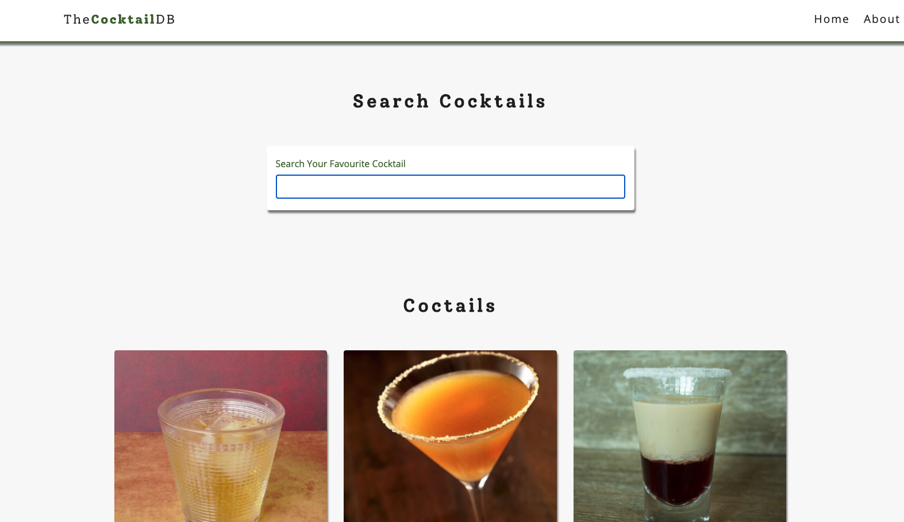

# Cocktail Database

> An app to search a cocktail.

an app using teh coctail database to search for your cocktail

## Built With

- Js,
- React,

## Live Demo

[Live Demo Link](tcdb.netlify.app)

## Getting Started

To get a local copy up and running follow these simple example steps.

### Prerequisites
Code editor
Node

### Setup
Clone the repo

### Install
$npm install

### Usage
$npm start 

### Deployment
$npm build

## Authors

👤 **Andres Rodriguez**

- Github: [@andynarf](https://github.com/andynarf)

## 🤝 Contributing

Contributions, issues and feature requests are welcome!

Feel free to check the [issues page](issues/).

## Show your support

Give a ⭐️ if you like this project!

## Acknowledgments

- Hat tip to anyone whose code was used
- Inspiration
- etc

## 📝 License

This project is [MIT](lic.url) licensed.